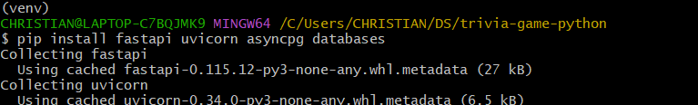
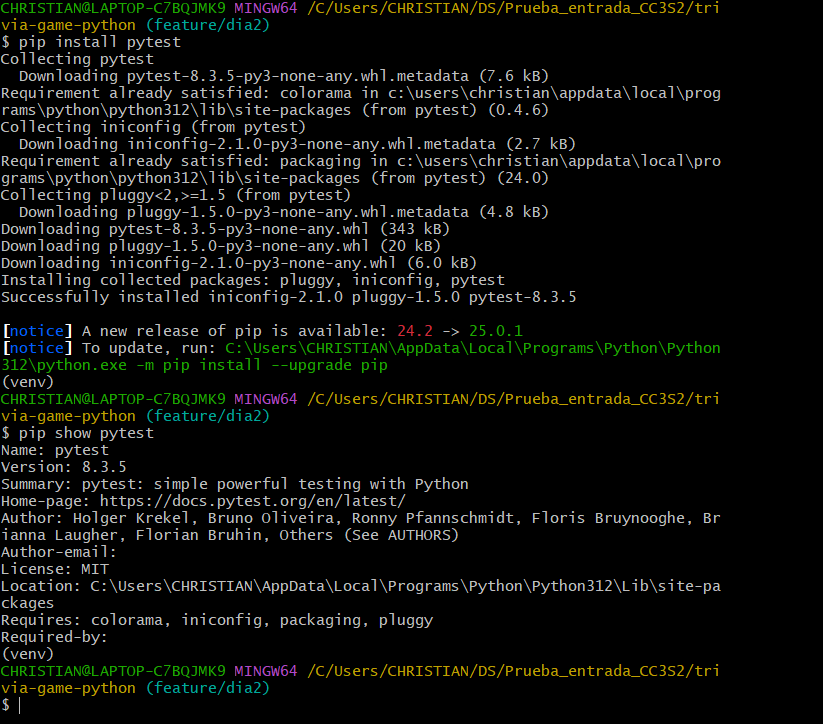
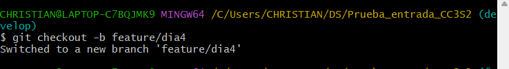
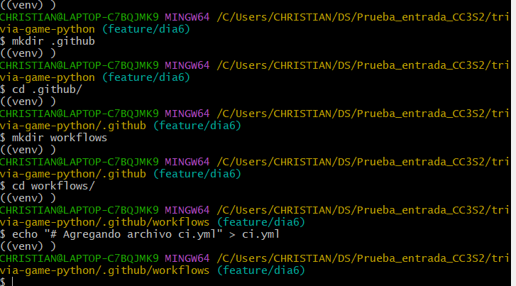

# *Día 1 - Configuración del entorno y estructura básica (Sprint 1 - Parte 1)*

- Configuración del proyecto:

  - Crear la carpeta del proyecto "trivia-game-python"

> {width="6.267716535433071in"
> height="1.2777777777777777in"}

- Configurar el entorno virtual con: python3 -m venv venv ; luego de
  ejecutar el comando esperamos un momento y cargará normal la consola

> {width="6.267716535433071in"
> height="0.8333333333333334in"}

- Para seguir con la configuración, en la guía nos indica un comando
  pero en Windows este comando difiere:

  - Comando Linux: source venv/bin/activate

  - Comando Windows: source ./venv/Scripts/Activate

{width="6.267716535433071in"
height="0.9166666666666666in"}

- Nota Agregada: Para desactivar el entorno, solo se pone
  ./venv/Scripts/Deactivate

- Instalación de dependencias: FastAPI, Uvicorn, asyncpg, databases y
  otras dependencias

  - Comando: pip install fastapi uvicorn asyncpg databases

{width="6.267716535433071in"
height="0.9444444444444444in"}

- Descarga más colecciones y al final quedaría así

> {width="6.267716535433071in"
> height="1.5555555555555556in"}

- Indicando una instalación exitosa

<!-- -->

- Crear archivos dockerfile y docker-composer.yml

  - Procedo a crear el archivo docker file (Para este paso usé el bash
    porque me permite ejecutar el comando touch Dockerfile mientras que
    en PowerShell no me deja)

    - Comandos:

      - touch Dockerfile

      - nano Dockerfile

{width="6.267716535433071in"
height="0.5277777777777778in"}

{width="6.267716535433071in"
height="3.638888888888889in"}

- Ademas con un pip freeze \> requeriments.txt creamos la lista de
  requerimientos y con nano requeriments.txt

> {width="6.267716535433071in" height="4.0in"}

- Para crear el docker-composer.yml se hará de la misma manera

- 

*DIA 2: Implementación de la clase Question y pruebas unitarias (Sprint
1 -- Parte 2)*

- Se crea la rama feature/dia2 y nos ubicamos ahí

> {width="6.267716535433071in"
> height="1.2638888888888888in"}

- Hasta el momento se tienen los siguientes archivos

> {width="6.267716535433071in"
> height="3.111111111111111in"}

- nos ubicamos en la carpeta app

> {width="6.267716535433071in"
> height="0.3333333333333333in"}

- Creamos el archivo trivia.py dentro de esa carpeta, con una linea
  inicial

  - "class Question:"

> {width="6.267716535433071in"
> height="0.4305555555555556in"}

- Añadimos el archivo, hacemos el primer commit desde la rama
  feature/dia2 y su push para crear desde ahora la rama dia2 en el
  repositorio de github (podemos hacer el commit y push al terminar de
  crear todo el archivo)

> {width="6.267716535433071in"
> height="0.9305555555555556in"}

- Ahora si completamos el archivo trivia.py con el siguiente script de
  la guía

- Para este día usé la IDEA Visual Studio, así que modifico el archivo
  trivia.py directamente desde ahí (uso nano para abrir el editor solo
  cuando estoy en gitbash)

> {width="6.267716535433071in"
> height="2.6527777777777777in"}

- Ahora si agregamos el archivo trivia.py para realizar su commit y push
  en su respectiva rama

> {width="6.267716535433071in"
> height="1.1111111111111112in"}

- Verificando en Github

- {width="6.267716535433071in"
  height="2.4305555555555554in"}

- Ahora regresamos a la carpeta trivia-game-python

> {width="6.267716535433071in"
> height="0.5277777777777778in"}

- Creamos la carpeta tests y nos ubicamos en ella

> {width="6.267716535433071in"
> height="2.236111111111111in"}

- Creamos la linea "import pytest" y que se guarde en el archivo
  test_trivia.py

> {width="6.267716535433071in"
> height="0.1527777777777778in"}

- Agregamos, comiteamos y pusheamos la modificación actual hasta el
  momento

> {width="6.267716535433071in"
> height="2.4583333333333335in"}

- Igual que con el archivo trivia.py, ingresamos el siguiente script en
  el archivo test_trivia.py

> {width="6.267716535433071in"
> height="3.1944444444444446in"}

- guardamos, agramos, comiteamos y pusheamos la modificación de la rama
  feature/dia2

> {width="6.267716535433071in"
> height="1.8888888888888888in"}

- Nuestros archivos actualmente serían

> {width="5.864583333333333in"
> height="4.65625in"}

- Teniendo los archivos .py creados, entramos al entorno virtual

- Entro a gisbash y entro al entorno

> {width="6.267716535433071in"
> height="1.1944444444444444in"}

- Instalamos pytest en el entorno para que nos permita usar el comando

> {width="6.267716535433071in"
> height="5.513888888888889in"}

- Por problemas externos, volví a crear mi entorno virtual ya que me
  tomaba variables globales y no las de mi entorno, pero ahora con todas
  las modificaciones, todo está así

> {width="6.267716535433071in"
> height="0.8055555555555556in"}

- Ejecutando el pytest me daba error debido a que, mi directorio actual
  es así\
  {width="6.267716535433071in"
  height="1.0694444444444444in"}

- donde trivia.py está en la carpeta app y test_trivia.py está en la
  carpeta tests, por lo tanto se modifica el codigo para que en vez de
  from trivia import Question, sea from app.trivia import Question

> {width="5.197916666666667in"
> height="0.7604166666666666in"}

- Ademas en el mismo directorio trivia-game-python se crea un pytest.ini
  que tenga la configuración de pytest

> {width="6.267716535433071in"
> height="0.5833333333333334in"}
>
> {width="5.4375in"
> height="0.9791666666666666in"}

- Ahora ejecutando pytest

> {width="6.267716535433071in"
> height="2.388888888888889in"}

- Esto indica que pasó las dos pruebas

- Ahora agregando más pruebas unitarias en el test_trivia.py

  - Respuesta Correcta

  - Respuesta Incorrecta

  - Respuesta Inválida

  - Ingresar dato Numérico y no String

  - Respuesta vacía

> {width="6.267716535433071in"
> height="3.611111111111111in"}

- Ejecutando pytest vemos que las pruebas pasan exitosamente

> {width="6.267716535433071in"
> height="2.3472222222222223in"}

- Ahora agregamos, commiteamos y hacemos un push desde la rama
  feature/dia2 que es la rama donde se ha hecho toda la modificación

- Volvemos a la rama develop y realizamos un git merge feature/dia2 para
  q se apliquen los cambios en la rama develop

> {width="6.267716535433071in"
> height="1.4444444444444444in"}

- Usando git blame trivia.py

> {width="6.267716535433071in"
> height="1.2916666666666667in"}

- Usando git blame test_trivia.py

> {width="6.267716535433071in"
> height="1.6527777777777777in"}

- Usando git diff develop..feature/dia1 para ver las diferencias en las
  ramas

> {width="6.267716535433071in"
> height="2.4722222222222223in"}

- Finalizamos el día añadiendo una etiqueta

- 

*Día 3 - Implementación de la clase Quiz y flujo básico del juego
(Sprint 1 -- Parte 3)*

- Entrar a nuestro entorno virtual

> {width="6.267716535433071in"
> height="1.5555555555555556in"}

- Creación y ubicación de la rama feature/dia3

> {width="6.267716535433071in" height="1.5in"}

- Agregando en el archivo trivia.py la clase quiz y la funcion run_quiz
  que nos mostrará las respuestas (Son preguntas de prueba)

> {width="6.267716535433071in"
> height="4.569444444444445in"}

- Probando la ejecución (Incorrect Answers)

> {width="6.267716535433071in"
> height="2.0555555555555554in"}

- Correct Answers

> {width="6.267716535433071in"
> height="1.9305555555555556in"}

- Agregando más preguntas en trivia.py

> {width="6.267716535433071in"
> height="1.0138888888888888in"}

- Realizamos git add, git commit y push para agregar la rama
  feature/dia3 en github

> {width="6.267716535433071in"
> height="2.5972222222222223in"}

- Volvemos a la rama develop y esta vez haremos un git merge \--no--ff
  feature/dia3

> {width="6.267716535433071in"
> height="1.6388888888888888in"}

- Verificando el historial

> {width="6.267716535433071in"
> height="3.8194444444444446in"}

- Realizando push desde la rama develop

> {width="6.267716535433071in"
> height="1.8055555555555556in"}

- Realizando el tag del día 3

> {width="6.267716535433071in"
> height="0.6666666666666666in"}

- Realizando push al tag para subirlo a github

> {width="6.267716535433071in"
> height="1.9722222222222223in"}

- Para finalizar revisaremos las diferencias de codigo con git diff
  feature/dia2..develop

> {width="6.267716535433071in"
> height="4.930555555555555in"}

- Nos muestra todos los cambios hechos y diferentes de la rama
  feature/dia2

- Ahora usaremos git blame para verificar quien modifico el archivo
  trivia.py

- {width="6.267716535433071in"
  height="1.4444444444444444in"}

- Con eso verificamos que usuario modificó el archivo, y con eso se
  culminaría el día 3

*Día 4 - Sistema de puntuación, manejo de rondas y finalización del
juego (Sprint 2)*

- Creación de la rama feature/dia4 para comenzar las actividades del día
  4

- {width="6.267716535433071in"
  height="0.8611111111111112in"}

- Ingresamos a nuestro entorno virtual

- {width="6.267716535433071in"
  height="1.2777777777777777in"}

- Nos dirigimos al archivo trivia.py para modificarla

- {width="6.267716535433071in"
  height="0.6944444444444444in"}

- Incluir los atributos correct_anwers e incorrect_answers

- {width="3.9270833333333335in"
  height="1.2708333333333333in"}

- Implementación del método answer_question

- {width="6.267716535433071in"
  height="4.069444444444445in"}

- Implementando el metodo test_quiz_scoring() en el archivo
  test_trivia.py

- {width="6.267716535433071in"
  height="1.5833333333333333in"}

- Luego de arreglar unos problemas entre los codigos trivia.py y
  test_trivia.py usamos en pytest para verificar el estado de las
  pruebas unitarias

- {width="6.267716535433071in" height="1.5in"}

- Implementar la funcion run_quiz con 10 rondas

- Luego de implementar las 10 rondas, modificamos el run_quiz para
  integrar todas las preguntas

- {width="4.760416666666667in"
  height="2.9166666666666665in"}

- Volver a la rama develop y realizar un git merge \--no-ff con la rama
  feature/dia4

- Revisando el historial de commits con git log \--graph \--oneline

- {width="6.267716535433071in"
  height="3.5416666666666665in"}

- Verificando las diferencias con el dia3

- {width="6.267716535433071in"
  height="2.7222222222222223in"}

- Verificando las modificaciones de los archivos y el autor de la
  modificacion del archivo trivia.py

- {width="6.267716535433071in"
  height="0.7916666666666666in"}

- {width="6.267716535433071in"
  height="1.0277777777777777in"}

- Tambien con respecto al archivo test_trivia.py

- {width="6.267716535433071in"
  height="3.513888888888889in"}

- Realizando un tag para culminar el dia4

- {width="6.267716535433071in"
  height="2.6527777777777777in"}

- 

*Día 5 - Mejoras en la interfaz de usuario y refinamientos (Sprint 3)*

- Creación de la rama feature/dia5 para comenzar las actividades del Día
  5\
  {width="6.267716535433071in"
  height="2.3055555555555554in"}

- Inicializamos nuestro entorno virtual\
  {width="6.267716535433071in" height="1.0in"}

- Nos dirigimos a la carpeta app para modificar el archivo trivia.py y
  refinar la presentación de preguntas y respuestas en la consola
  modificando la función run_quiz\
  {width="6.267716535433071in"
  height="1.0694444444444444in"}\
  {width="6.267716535433071in"
  height="4.958333333333333in"}

- Agregamos el atributo de level a las preguntas y agregamos metodos en
  la clase Quiz para seleccionar preguntas de acuerdo a su level\
  {width="6.267716535433071in"
  height="5.069444444444445in"}

- Agregamos más pruebas de testeo en el archivo test_trivia.py\
  {width="6.267716535433071in"
  height="1.6111111111111112in"}

- Guardamos, comiteamos y hacemos un push para generar la rama
  feature/dia5 en github\
  {width="6.267716535433071in"
  height="2.1944444444444446in"}

- Volvemos a la rama develop y realizamos un git merge \--no-ff
  feature/dia5

- Analizando el historial de commits

- {width="6.267716535433071in"
  height="4.027777777777778in"}

- Verificando las diferencias con el dia 4\
  {width="6.267716535433071in"
  height="2.861111111111111in"}

- Realizamos un push en la rama develop\
  {width="6.267716535433071in"
  height="1.6805555555555556in"}

- Y realizamos un tag para finalizar las actividades del dia 5 y su
  respectivo push\
  {width="6.267716535433071in"
  height="1.7638888888888888in"}

*Día 6 - Pipeline CI/CD y pruebas de integración*

- Creacion de la rama feature/dia6 para realizar las actividades del día
  6

> {width="6.267716535433071in"
> height="1.8888888888888888in"}

- Creación del archivo .github/workflows/ci.yml\
  {width="6.267716535433071in"
  height="3.4722222222222223in"}\
  {width="6.267716535433071in" height="2.5in"}

- Modificamos el archivo ci.yml\
  {width="6.267716535433071in"
  height="4.75in"}

- Crear el archivo tests/integration/test_api.py\
  {width="6.267716535433071in"
  height="2.513888888888889in"}

- Agregamos un script en test_api.py\
  {width="5.291666666666667in"
  height="3.125in"}

- Comiteamos todo y realizamos un push

- Volvemos a la rama develop y hacemos un merge \--no-ff con
  feature/dia6

- Analizamos el historial de commits\
  {width="6.267716535433071in"
  height="2.8055555555555554in"}

- Cuando hacemos push, y verificamos github actions, notamos que nos
  valida todo con un check verde

{width="4.817084426946631in"
height="0.8500732720909886in"}

- Y con eso se culmina dia 7

*Día 7 - Gestión de configuración, seguridad y pruebas de rendimiento*

- Creamos la rama feature/dia7 y según la guía tenemos que crear el
  archivo .env pero ya lo teniamos creado así que pasamos al siguiente
  paso que es modificar el archivo main.py

- {width="4.642069116360455in"
  height="3.925340113735783in"}

- Luego modificamos el archivo ciyml para que evalue lo agregado con
  bandit

{width="4.383333333333334in"
height="6.341666666666667in"}

- Verificamos que pase las pruebas de github actions y procedemos a
  crear el archivo locustfile.py

- {width="2.875249343832021in"
  height="1.3001126421697289in"}

- Al ejecutar el docker, veremos que la web de locus se sincroniza y nos
  muestra las pruebas de rendimiento de la aplicación, luego realizamos
  su merge con la rama develop, su commit y push

- Generamos la etiqueta v1.0-day7 y terminamos las actividades del día 7
